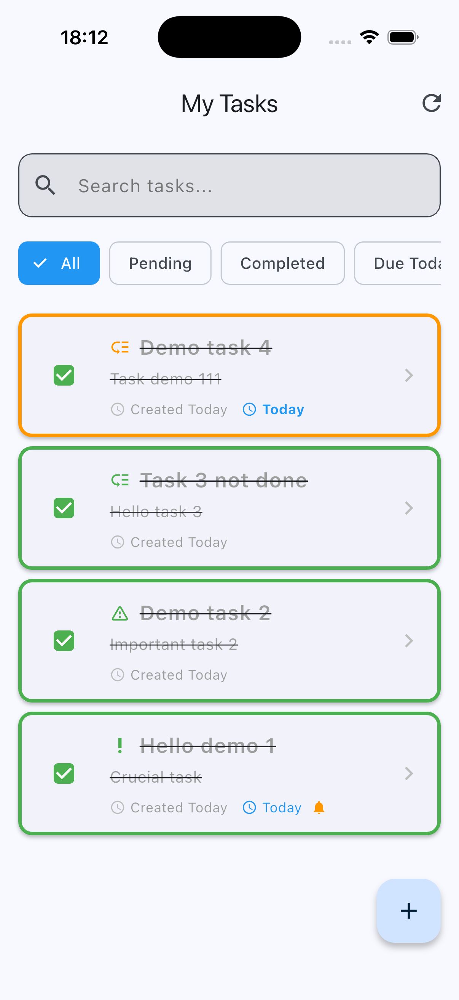
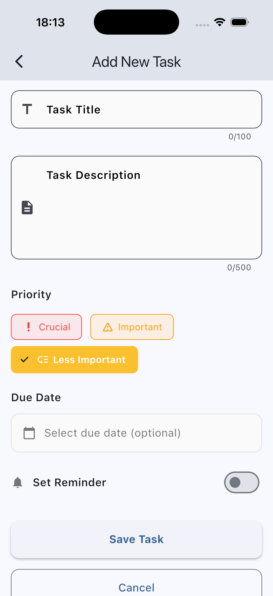
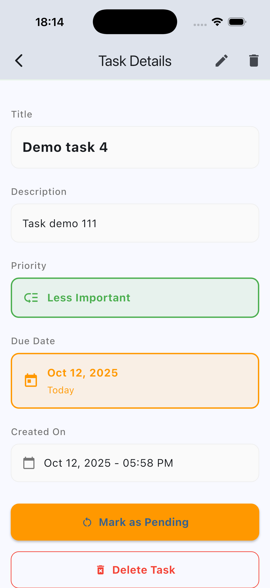
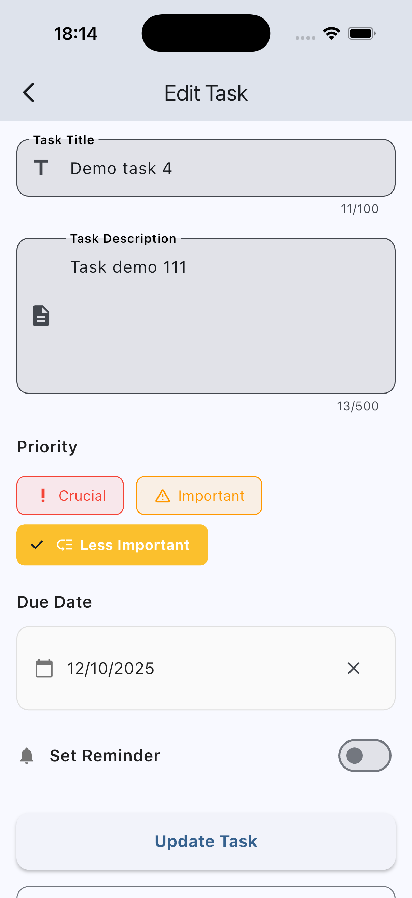

# To-Do App

A production-ready Flutter To-Do application with advanced task management features.

## ✨ Features

- **Task Management**: Create, edit, delete, and mark tasks as complete
- **Priority System**: Crucial (Red), Important (Orange), Less Important (Yellow), Completed (Green)
- **Due Dates & Reminders**: Set deadlines with visual indicators for overdue tasks
- **Search & Filter**: Real-time search with filters for All, Pending, Completed, Due Today, Overdue
- **Swipe Gestures**: Swipe right to complete, swipe left to delete
- **Modern UI**: Material Design 3 with responsive design

## 🛠️ Tech Stack

- **Flutter** 3.9.2+
- **SQLite** with automatic migrations
- **Provider** for state management
- **Clean Architecture**

## 🚀 Getting Started

```bash
flutter pub get
flutter run
```

## 📁 Key Files

- `main.dart` - App entry point
- `models/task.dart` - Task data structure
- `services/database_service.dart` - Database operations
- `providers/task_provider.dart` - State management
- `screens/home.dart` - Main task list
- `screens/addtask.dart` - Create tasks
- `screens/edittask.dart` - Edit tasks
- `screens/detailedview.dart` - Task details

## 📱 App Screenshots

### Home Screen


### Add Task Screen


### Task Details Screen


### Edit Task Screen



## 🎓 Skills Demonstrated

- Flutter development
- SQLite database management
- State management with Provider
- Date/time handling
- UI/UX design
- Clean architecture
- Error handling
- Responsive design

## 📄 License

MIT License